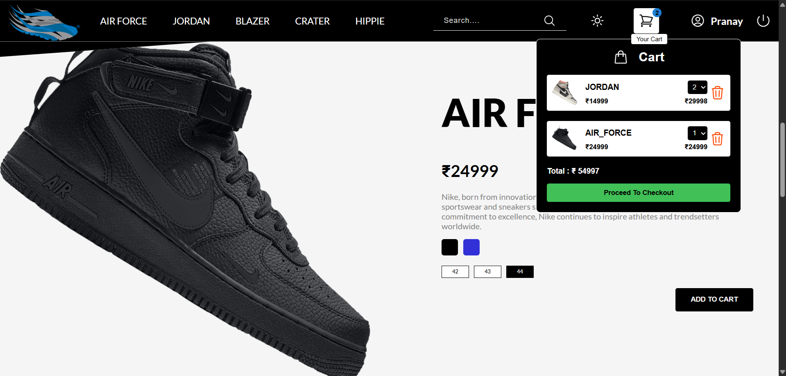
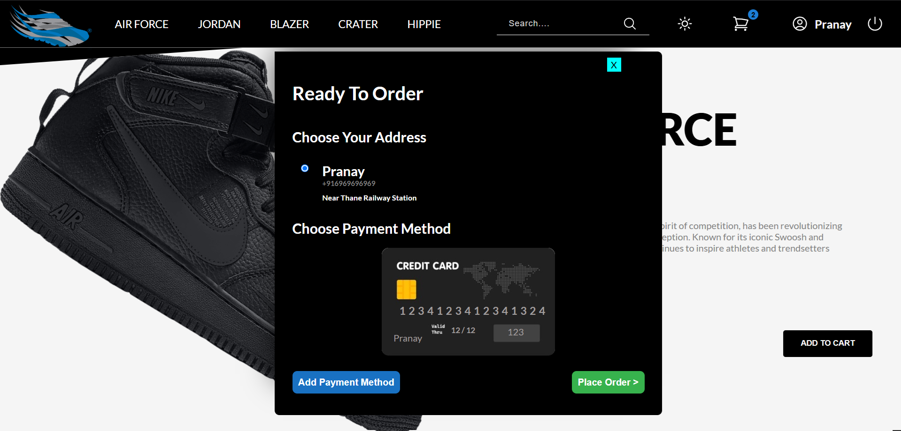

# 👟 ShoeStop — Online Shoe Selling Website

Welcome to **ShoeStop**, your one-stop online shop for the latest and trendiest shoes!  
This project is a fully functional web application built with **Node.js**, **HTML**, **CSS**, and **JavaScript**.  
It combines modern features, an elegant UI, and smooth functionality to create an amazing shopping experience. ✨

---

## 🚀 Features

- 🛍️ **Product Slider** — Browse featured shoes in style with a smooth image slider.
- 🛒 **Shopping Cart** — Add, view, and remove products from your cart in real time.
- 👤 **User Authentication** — Sign up and log in securely.
- 🎨 **Theme Switcher** — Toggle between light and dark themes for a personalized experience.
- 💅 **Elegant UI** — Clean, modern design that's responsive and user-friendly.

---

## 🛠️ Tech Stack

| Frontend        | Backend  |
|----------------|----------|
| HTML           | Node.js  |
| CSS (custom)   | Express  |
| JavaScript     |          |

---

## 🔧 Installation

1. Clone the repo:
   ```bash
   git clone https://github.com/your-username/shoestop.git
   cd shoestop


📸 Screenshots

### 🏠 Home Page


### 🛒 Cart Page


### 🌙 Advertisment Page


### 🙌 Footer


### 🤑 Payment Page


🤝 Contributing
Contributions are welcome!
Feel free to fork the repo and submit a pull request. 👟✨

📄 License
This project is licensed under the LOL License.

Created with 💙 by Pranay
🔗 LinkedIn | 🌐 Portfolio